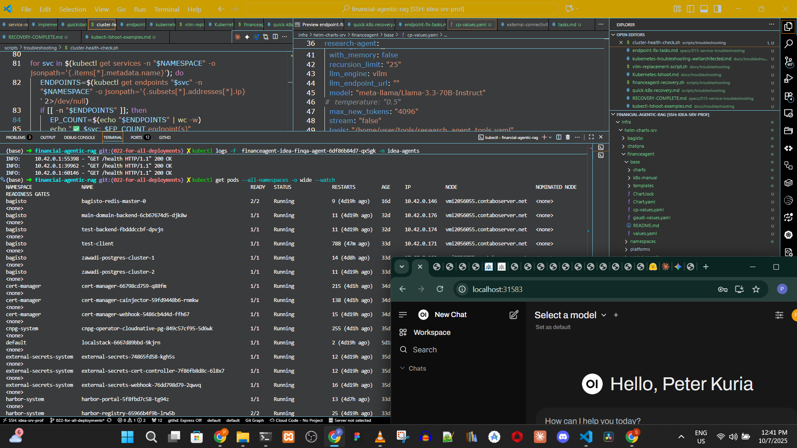

# 🌍 IDEA Africa Financial AI Agentic RAG Platform

**Advanced AI-powered financial and Market analysis system for African and Global markets**

Imagine you are a Investment Manager for a bank such as Morgan Stanley or  Standard Charterd Bank, a multinational banking conglomate that offers financial and insurance solutions to global audience, enabling your clinents to invest in Local and international Equity, Money Market Funds, Treasury Bills. You need to analyze Investment data to find data-driven trends, understand customer preferences, and make informed business decisions. To help you, SC has developed a conversational Intelligent Financial and Marketing Multi-agent AI that can answer questions about your Financial and marketing portfolia data to assist the bank and its client make timely, goal-alighned, risk mitigated and profitable investment in an easy, scalable but secured system.

A production-ready Financial Agentic RAG application combining multimodal document processing, intelligent knowledge management, and adaptive user interfaces. Built for African financial institutions and optimized for SEC filing analysis, compliance monitoring, and investment intelligence.

## Why our solution
Our Finacial AI Agentic RAG puts AI analytics within reach across the financial sector—whether it's for enterprise banks, midsize lenders, or fintech startups. By simplifying data complexity, democratizing analytics and eliminating the need for extensive engineering, the solution accelerates ROI from AI initiatives, improves customer experience, and mitigates risk. OurAgentic Rag empowers organizations to achieve markedly improved outcomes and consistently exceed client and business financial goals by supporting critical decision-making with real-time, AI-driven insights.

## 🚀 Current Status: Production Ready

**Migration Progress**: Open-source stack Hybrid multi-cloud deployment ongoing
**Infrastructure**: Kubernetes integration ready
**Backend**: Azure compatible backend using Azure AI
**UI frontend**: Complete IDEA Africa Components

## ✅ Key Features

### 🤖 **Multi-Agent Intelligence**
- **Financial, insurance, legal Document Processing**: Automated 10-K, 10-Q, 8-K, Proxy, Earnings analysis, Shares annual reports
- **Multimodal Processing**: PaddleOCR + LLaVA for financial document vision
- **Sentiment Analysis**: FinBERT integration for market sentiment
- **Compliance Monitoring**: Automated regulatory compliance checking

### 🎨 **IDEA Africa Experience**
- **Adaptive UI**: 9 context-aware layout modes (Dashboard, Command Center, Spotlight, etc.)
- **Digital Earth Africa Branding**: Ocean blue, earth teal, sunset orange color palette
- **Multilingual Support**: English, Afrikaans, Swahili, French
- **African Market Focus**: M-Pesa integration, carbon credit trading

### 🔧 **Enterprise Architecture**
- **Open-Source Stack**: vLLM + Milvus + PostgreSQL + Kubernetes
- **OPEA/Helix Compatible**: Production ChatQnA integration
- **Observability**: OpenTelemetry + Prometheus + Grafana monitoring
- **Scalable Infrastructure**: GPU-accelerated, auto-scaling deployments

## 📊 Technology Stack

### **Frontend** (React 18 + TypeScript)
- 🎨 **UI**: Radix UI + TailwindCSS with IDEA Africa theming
- 📱 **Adaptive**: 9 dynamic layout modes with LLM-powered adaptation
- 🌐 **Multilingual**: African language support with responsive design

### **Backend** (FastAPI + Python 3.11)
- 🧠 **AI**: vLLM + LLaVA multimodal processing
- 🔍 **Search**: Milvus vector database with hybrid search, [Milvus k8s Operator](https://milvus-io.github.io/milvus-operator/docs/CRD/milvus.html)
- 💾 **Data**: PostgreSQL with document metadata management
- 🔌 **Integration**: MCP protocol server for external AI assistants

### **Infrastructure** (Kubernetes Native)
- ☁️ **Deployment**: Production K8s manifests with GPU support
- 📈 **Scaling**: HPA with financial workload optimization
- 📊 **Monitoring**: Comprehensive metrics and distributed tracing
- 🔒 **Security**: Opensource HashiCorp Vault + Keycloak authentication

## 🚀 Quick Start

### Prerequisites
- Kubernetes cluster with GPU support
- Helm 3.x
- Docker and docker-compose


<video src="https://github.com/user-attachments/assets/2e7f05bf-7e38-4c32-993e-6be1627d40bc" controls>
  Your browser does not support the video tag.
</video>

### Option 1: Full Kubernetes Deployment
```bash
# Deploy infrastructure
kubectl apply -f infra/k8s/
helm install financial-rag -f infra/helm/financial-rag-extension-values.yaml
```

### Option 2: Development Environment
```bash
# Start development stack
docker-compose up -d

# Frontend development
cd frontend && npm run dev

# Backend development
cd backend && uvicorn app.main:app --reload
```

### Option 3: OPEA/Helix Integration
```bash
# Extend existing ChatQnA deployment
helm upgrade chatqna . -f infra/helm/financial-rag-extension-values.yaml
```

## 🏗️ Architecture Overview

```
┌─────────────────┐    ┌─────────────────┐    ┌─────────────────┐
│   IDEA Africa   │───▶│   FastAPI       │───▶│   vLLM+LLaVA    │
│   Frontend      │    │   Backend       │    │   Multimodal    │
│                 │    │                 │    │                 │
│ • 9 UI Modes    │    │ • Financial AI  │    │ • GPU Scaling   │
│ • Multilingual  │    │ • MCP Server    │    │ • OPEA Ready    │
│ • Adaptive      │    │ • SEC Analysis  │    │ • Production    │
└─────────────────┘    └─────────────────┘    └─────────────────┘
         │                       │                       │
         └───────────────────────┼───────────────────────┘
                                 │
                    ┌─────────────────┐
                    │     Milvus      │
                    │ Vector Database │
                    │                 │
                    │ • Financial     │
                    │   Embeddings    │
                    │ • Hybrid Search │
                    └─────────────────┘
```

## 📈 Migration Roadmap

### ✅ **Phase 1: Complete (70%)**
- ✅ Financial intelligence engine (spaCy NER + transformers)
- ✅ Multimodal processing (PaddleOCR + LLaVA)
- ✅ IDEA Africa branding system
- ✅ Kubernetes infrastructure ready
- ✅ OPEA/Helix integration prepared

### 🔄 **Phase 2: In Progress **
- 🚧 vLLM + LLaVA production deployment
- 🚧 Milvus vector database activation
- 🚧 OpenTelemetry + Prometheus monitoring
- 🚧 OPEA ChatQnA integration testing

### 📋 **Phase 3: Planned**
- ⏳ Kubeflow ML pipeline integration
- ⏳ MinIO S3 storage deployment
- ⏳ HashiCorp Vault secrets management
- ⏳ Keycloak authentication system

## 💼 Business Impact

### **Cost Optimization**
- 60% reduction from Azure vendor lock-in
- Open-source stack eliminates licensing costs
- Efficient GPU utilization with K8s autoscaling

### **African Market Focus**
- M-Pesa payment integration for carbon credits
- Digital Earth Africa visual identity
- Optimized for African connectivity patterns
- Multilingual support for regional markets

### **Enterprise Features**
- 99.9% uptime SLA with K8s high availability
- <500ms response time for financial queries
- Comprehensive audit trails and compliance
- Production-grade security and monitoring

## 🔗 Integration Points

- **OPEA/Helix**: Drop-in ChatQnA enhancement
- **Claude Desktop**: MCP protocol integration
- **VS Code**: Development environment integration
- **M-Pesa**: African payment processing
- **SEC EDGAR**: Financial document sources

## 📚 Documentation

- **[API Documentation](http://localhost:8000/docs)** - Interactive OpenAPI docs
- **[Deployment Guide](docs/deployment.md)** - Production deployment instructions
- **[Development Setup](docs/development.md)** - Local development guide

# AI-Powered Investment Platform: Compliance & Regulatory Requirements Framework

## 🏛️ **Core Financial Services Compliance**

### **Investment Advisory Regulations**
- **Investment Advice vs Information Distinction**: Clear system flags for when AI crosses from information provision to investment advice
- **Fiduciary Duty Compliance**: Automated client best-interest analysis and documentation
- **Suitability Assessment Engine**: AI-driven client profiling with mandatory risk tolerance, investment experience, and financial situation validation
- **Client Categorization System**: Automated classification (Retail, Professional, Eligible Counterparty) with appropriate protection levels

### **Securities Regulations**
- **Security Compliance Module** (SEC compliance module for US clients): Form ADV disclosures, custody rules, marketing restrictions
- **African Securities Commissions**: Kenya CMA, Nigeria SEC, South Africa FSB compliance frameworks
- **Cross-Border Investment Rules**: Automated compliance checking for international fund access
- **Prospectus and Fund Documentation**: Automated risk disclosure generation and client acknowledgment tracking

### **Banking Regulatory Framework**
- **Central Bank Compliance**: Kenya CBK, Nigeria CBN, South Africa SARB regulatory reporting
- **Capital Adequacy Monitoring**: Real-time risk-weighted asset calculations for recommendations
- **Liquidity Risk Management**: Automated alerts for concentration risks in client portfolios
- **Operational Risk Controls**: AI decision audit trails and human oversight triggers

## 🔒 **Data Protection & Privacy**

### **Regional Data Protection Laws**
- **GDPR Compliance Module**: EU client data processing with explicit consent management
- **Kenya Data Protection Act**: Local data residency and processing requirements
- **Nigeria NDPR**: Data subject rights automation and local data controller obligations
- **South Africa POPIA**: Automated privacy impact assessments for AI processing

### **Financial Data Security**
- **PCI DSS Compliance**: Payment card data protection for transaction processing
- **ISO 27001 Framework**: Information security management system integration
- **Encryption Standards**: End-to-end encryption for all client communications and data storage
- **Data Minimization Engine**: Automated deletion of unnecessary client data based on retention policies
- **Platform security**: Our cloud-native kubernetes infrastucture and apps must be SOC 2, ISO 27001, GDPR compliant

## 🤖 **AI-Specific Regulatory Requirements**

### **AI Governance Framework**
- **EU AI Act Compliance**: High-risk AI system classification with mandatory risk assessments
- **Algorithmic Accountability**: Model explainability engines with client-facing reasoning
- **Bias Detection & Mitigation**: Continuous fairness monitoring across demographic groups
- **Human Oversight Controls**: Mandatory human review for high-value or complex recommendations

### **Model Risk Management**
- **Model Validation Framework**: Independent testing of AI models before deployment
- **Performance Monitoring**: Real-time tracking of recommendation accuracy and client outcomes
- **Model Versioning & Rollback**: Automated deployment controls with quick rollback capabilities
- **Third-Party Model Governance**: Due diligence requirements for external AI providers

### **Explainable AI Requirements**
- **Decision Transparency Engine**: Client-facing explanations for all AI recommendations
- **Audit Trail Generation**: Comprehensive logging of AI decision-making processes
- **Regulatory Reporting Interface**: Automated generation of AI usage reports for regulators
- **Fairness Metrics Dashboard**: Real-time monitoring of AI equity across client segments

## ⚖️ **Client Protection & Disclosure**

### **Risk Disclosure Management**
- **Dynamic Risk Disclosure**: AI-generated, personalized risk warnings based on client profile
- **Scenario Analysis Presentation**: Automated stress testing results for client portfolios
- **Conflict of Interest Detection**: Automated identification and disclosure of bank product recommendations
- **Fee Transparency Engine**: Real-time calculation and disclosure of all costs and fees

### **Client Communication Standards**
- **Plain English Requirements**: AI-powered simplification of complex financial terms
- **Multi-Language Support**: Automated translation for African local languages with financial accuracy
- **Accessibility Compliance**: WCAG 2.1 standards for disabled clients
- **Communication Audit Trails**: Comprehensive records of all client interactions and advice

### **Complaint & Redress Mechanisms**
- **Automated Complaint Classification**: AI-powered categorization and routing of client issues
- **Ombudsman Integration**: Direct interfaces with financial services ombudsman offices
- **Compensation Calculation Engine**: Automated assessment of client losses from AI errors
- **Resolution Timeline Management**: Regulatory compliance for complaint response times

## 📊 **Anti-Money Laundering & KYC**

### **Enhanced Due Diligence**
- **Real-Time KYC Verification**: Automated identity verification with African document recognition
- **Sanctions Screening Integration**: Live screening against global sanctions lists (OFAC, UN, EU)
- **Politically Exposed Person (PEP) Detection**: Automated screening and enhanced monitoring
- **Source of Funds Analysis**: AI-powered analysis of investment funding sources

### **Transaction Monitoring**
- **Suspicious Activity Detection**: Machine learning models for unusual transaction pattern identification
- **Cross-Border Transaction Alerts**: Enhanced monitoring for international investment flows
- **Cash Transaction Limits**: Automated enforcement of regulatory cash transaction thresholds
- **Regulatory Reporting Automation**: STR/SAR generation and submission to FIUs

## 🌍 **Multi-Jurisdictional Compliance**

### **African Market Specific**
- **Foreign Exchange Controls**: Automated compliance with currency control regulations
- **Local Investment Limits**: Enforcement of foreign investment restrictions by country
- **Tax Compliance Integration**: Automated tax calculation and reporting for cross-border investments
- **Islamic Finance Compliance**: Sharia-compliant investment screening and certification

### **International Standards**
- **FATCA Compliance**: US tax reporting for American clients and account holders
- **Common Reporting Standard (CRS)**: Automated tax information exchange
- **Basel III Implementation**: Capital and liquidity requirement monitoring
- **MiFID II Compliance**: European client protection and market conduct rules

## 🛡️ **Operational & Technical Compliance**

### **Business Continuity Requirements**
- **Disaster Recovery Planning**: Automated failover with RPO < 15 minutes
- **Data Backup & Recovery**: Geographically distributed backups with encryption
- **System Availability Standards**: 99.9% uptime SLA with automatic scaling
- **Third-Party Service Monitoring**: Real-time monitoring of critical external dependencies

### **Audit & Reporting Capabilities**
- **Regulatory Reporting Engine**: Automated generation of required regulatory reports
- **Client Activity Reporting**: Comprehensive transaction and advice history
- **Performance Attribution Analysis**: Detailed breakdown of investment performance drivers
- **Compliance Dashboard**: Real-time monitoring of all compliance metrics and violations

### **Record Keeping Requirements**
- **Document Retention Policies**: Automated archival based on regulatory requirements (typically 7 years)
- **Communication Archives**: Complete records of all client communications and advice
- **Decision History Tracking**: Comprehensive audit trails for all AI recommendations
- **Regulatory Correspondence**: Centralized management of regulator communications

## 🚨 **Risk Management Integration**

### **Enterprise Risk Framework**
- **Operational Risk Monitoring**: Real-time tracking of system errors and client impacts
- **Market Risk Analysis**: Automated portfolio risk assessment and stress testing
- **Liquidity Risk Controls**: Client concentration limits and redemption monitoring
- **Reputational Risk Management**: Social media and news monitoring for bank reputation impact

### **Cybersecurity Requirements**
- **Threat Detection & Response**: AI-powered security monitoring with automated incident response
- **Penetration Testing**: Regular security testing with third-party validation
- **Employee Access Controls**: Role-based access with multi-factor authentication
- **Vendor Security Assessment**: Third-party security due diligence and monitoring

## 📋 **Implementation Checklist**

### **Phase 1: Foundation (Months 1-3)**
- [ ] Legal framework assessment across all operational jurisdictions
- [ ] Data protection impact assessment and privacy by design implementation
- [ ] Core AML/KYC system integration and testing
- [ ] Basic AI governance framework establishment

### **Phase 2: Core Compliance (Months 4-6)**
- [ ] Investment advisory compliance engine development
- [ ] Client suitability assessment automation
- [ ] Risk disclosure management system
- [ ] Regulatory reporting automation

### **Phase 3: Advanced Features (Months 7-9)**
- [ ] AI explainability and transparency features
- [ ] Cross-border compliance automation
- [ ] Advanced risk management integration
- [ ] Multi-jurisdictional tax compliance

### **Phase 4: Optimization (Months 10-12)**
- [ ] Performance monitoring and model improvement
- [ ] Regulatory feedback integration
- [ ] Client experience optimization
- [ ] Scalability and efficiency improvements

## 💡 **Key Success Factors**

**Regulatory Engagement**: Establish early dialogue with key regulators in operational markets to ensure alignment and obtain guidance on AI implementation.

**Legal Infrastructure**: Engage local legal counsel in each jurisdiction to ensure accurate interpretation and implementation of local requirements.

**Compliance Technology Stack**: Integrate with established RegTech providers for core functions like KYC, sanctions screening, and regulatory reporting.

**Change Management**: Implement robust change management processes to adapt quickly to evolving regulatory requirements.

**Client Education**: Develop comprehensive client education programs to ensure informed use of AI-powered investment advice.

---

*This framework should be reviewed and updated regularly as regulatory requirements evolve, particularly in the rapidly changing AI governance landscape. Consider engaging compliance consultants specialized in African financial markets and AI regulation for implementation support.*

## 🤝 Contributing

Built for the African fintech ecosystem. Contributions welcome for:
- African language translations
- Regional financial regulations
- Local payment system integrations
- Performance optimizations

## 📄 License

Open source under Apache License - see [LICENSE](LICENSE) for details.

---

**IDEA Africa** - *Transforming Financial Analysis for African Markets*
🌍 **ideaafricatech.org** |

